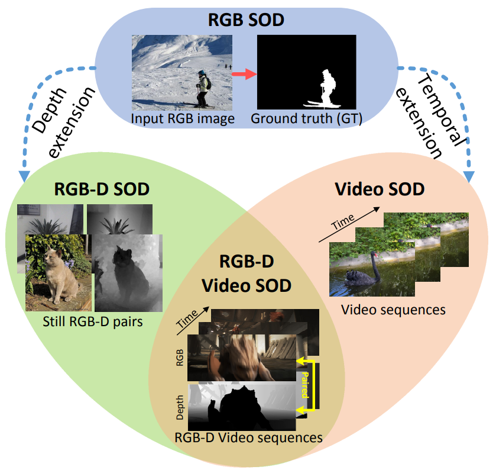
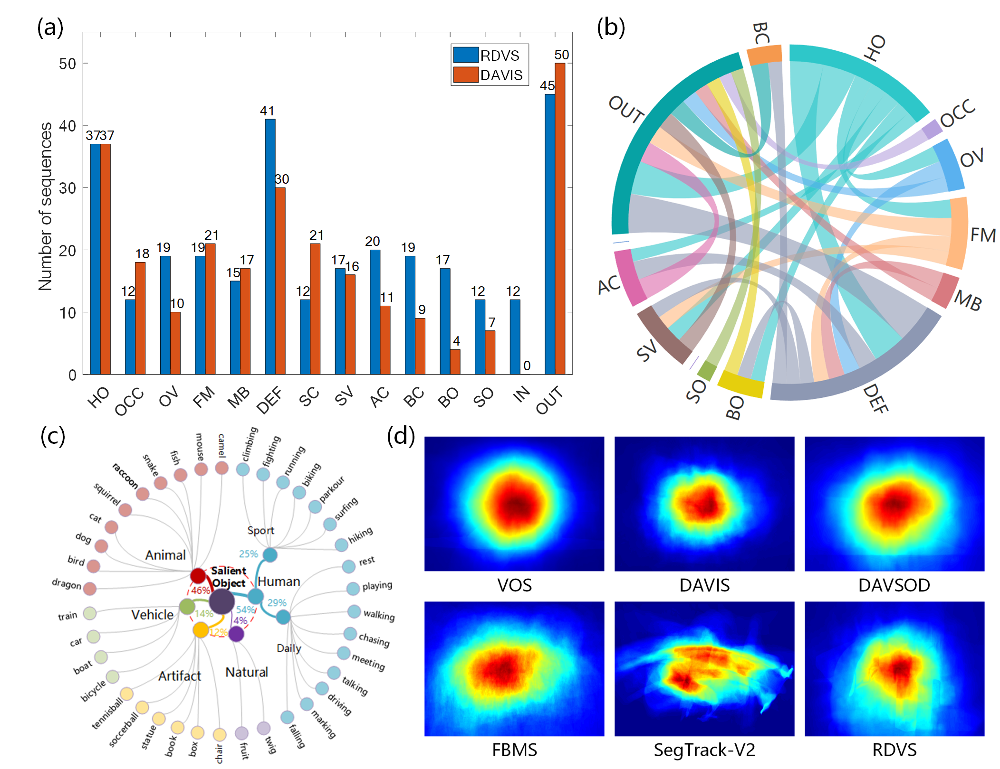
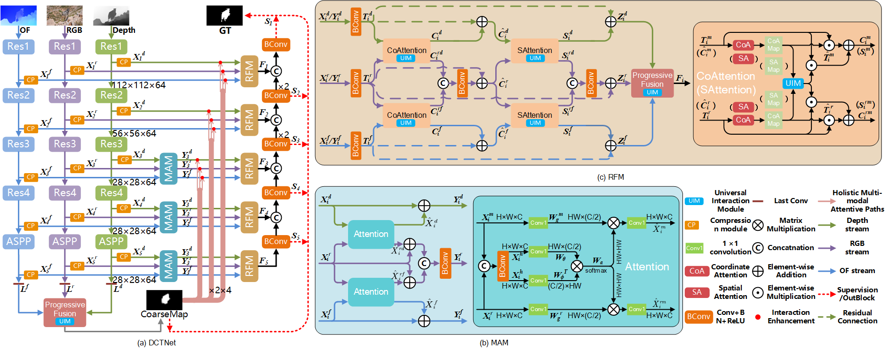

# Salient Object Detection in RGB-D Videos (RDVS dataset and DCTNet+ model)

## This site is still under construction.... 

Code for paper, '**Salient Object Detection in RGB-D Videos**' 

## Task Relationship

      
    <em> 
    Figure 1: Due to the limitation of using a single RGB/color modality (image) for SOD (termed RGB SOD), researchers have integrated scene depth information into the SOD task, often referred to as RGB-D SOD. Meanwhile, extending still images to the temporal case yields the video SOD (VSOD) task. We target at the RGB-D VSOD task, which can be deemed as extension from the prevalent RGB-D SOD and VSOD tasks.
    </em>

> To delve into such a potential task, and as one of the earliest works towards RGB-D VSOD, we contributes on two distinct aspects: 1) the dataset, and 2) the model.

## Proposed Dataset: RDVS

> We propose a new RGB-D Video Salient Object Dataset incorporating realistic depth information, and the dataset is named RDVS for short. RDVS contains 57 sequences, totaling 4,087 frames, and its annotation process is guided rigorously by gaze data captured from a professional eye-tracker. The collected video clips encompass various challenging scenarios, \e.g., complex backgrounds, low contrast, occlusion, and heterogeneous objects. We also provide training and testing splits. **Download the RDVS from [RDVS Dataset](#1-RDVS-dataset.).**

      
    <em> 
    Figure 2: Statistics of the proposed RDVS dataset.
    </em>

Figure 2 shows (a) Attribute-based analyses of RDVS with comparison to DAVIS. (b) The pairwise dependencies across different attributes. (c) Scene/object categories of RDVS. (d) Center bias of RDVS and existing VSOD datasets.

      
    <em> 
    Figure 3: Illustrative frames (with depth in the bottom-right) from RDVS with fixations (red dots, the top row) and the corresponding continuous saliency maps (overlaying on the RGB frames, the bottom row).
    </em>

## Proposed Model: DCTNet+
### Overview

      
    <em> 
    Overview of DCTNet+. (a) shows the big picture. (b) and (c) show the details of MAM and RFM, respectively. In the attention operations on the right-hand side in (c), since the coordinate attention and spatial attention processes are similar, the operations of spatial attention are represented in parentheses and are not repeated.
    </em>

### Usage
1. Requirements
   - Python 3.9
   - PyTorch 1.12.1
   - Torchvision 0.13.1
   - Cuda 11.6

2. Training
   - Download the pre_trained ResNet34 backbone: [Baidu Pan](https://pan.baidu.com/s/11-u_voUDqbHZKO9rdZcjpg?pwd=wm08)(fetch code:wm08) | [Google Drive]() to './model/resnet/pre_train/'.
   - Download the train dataset (containing DAVIS16, DAVSOD, FBMS and DUTS-TR) from [Our training set and test set](#3-Our-training-set-and-test-set.) and save it at './dataset/train/*'.
   - Download the pre_trained RGB, depth and flow stream models from [Baidu Pan](https://pan.baidu.com/s/1yaKnOoqMLwKI99qyoFVaCA?pwd=wm08)(fetch code:wm08) | [Google Drive]() to './checkpoints/'
     - Noting: the pre_trained RGB should be saved at './checkpoints/spatial', pre_trained depth shoule be saved at './checkpoints/depth' and flow is same. 
   - The training of entire DCTNet is implemented on one NVIDIA RTX 3090 GPU.
     - run  `python train.py` in terminal
3. Testing
   - Download the test data (containing DAVIS16, DAVSOD, FBMS, SegTrack-V2, VOS) from [Our training set and test set](#3-Our-training-set-and-test-set.) and save it at './dataset/test/*'
   - Download the trained model from [DCTNet+ model](#2-DCTNet+-model.)(original model ckpt) and modify the  `model_path` to its saving path in the `test.py`.
   - Run `python test.py` in the terminal.

## Downloads
### 1. RDVS dataset.
- Full dataset with **realistic depth** (4.84G, 57 sequences): [Baidu Pan](链接：https://pan.baidu.com/s/19urVlOpI6u9aoYYAGt4XaA?pwd=wm08)(fetch code:wm08) | [Google Drive](https://drive.google.com/file/d/1qTlyTZH4txUF5BGClBj29VFVxjAuSFCj/view?usp=share_link) (**Update link:2023-10-23**)
- Full dataset with synthetic deptn (4.76G, 57 sequences): [Baidu Pan](https://pan.baidu.com/s/1pacr_DsFtGI5MRwfx3p2Lw?pwd=wm08)(fetch code:wm08) | [Google Drive]() (**Update link:**)
- Training Set containing realistic and synthetic depth (2.56G, 32 sequences): [Baidu Pan](https://pan.baidu.com/s/1benryV0Gzdh0iv3-x3P3JA?pwd=wm08)(fetch code:wm08) | [Google Drive]() (**Update link:**)
- Test Set containing realistic and synthetic depth (2.30G, 25 sequences): [Baidu Pan](https://pan.baidu.com/s/1Oa6P2HwZ9kFlyZ6pTRj-7g?pwd=wm08)(fetch code:wm08) | [Google Drive]() (**Update link:**)
- **Noting: realistic depth is in "/Depth" and synthetic depth is in "/SyntheticDepth"**
  

### 2. DCTNet+ model.
- original model ckpt: [Baidu Pan](https://pan.baidu.com/s/1T_f_IPM9cJt4pzWbFTSgQQ?pwd=wm08)(fetch code:wm08) | [Google Drive]()
- finetune on the test set of RDVS with **realistic depth**: [Baidu Pan](https://pan.baidu.com/s/1zSD_0ZyeSCedcyJcLX0G-w?pwd=wm08)(fetch code:wm08) | [Google Drive]()
- finetune on the test set of RDVS with **synthetic depth**: [Baidu Pan](https://pan.baidu.com/s/1TpKoZULR-yuAeCvrNVoalg?pwd=wm08)(fetch code:wm08) | [Google Drive]()

### 3. Our training set and test set.
- training set: [Baidu Pan](https://pan.baidu.com/s/19Rqfims6hGc8MjPkoKCrJg?pwd=wm08)(fetch code:wm08) | [Google Drive]()
- test set: [Baidu Pan](https://pan.baidu.com/s/1_oNo4X7kSuxNumbTGqeZEg?pwd=wm08)(fetch code:wm08) | [Google Drive]()

### 4. Saliency Maps on RDVS dataset.
- Noting: including RGB-D models, VSOD models, DCTNet and our **DCTNet+(last line)**.

  |**Year**|**Publisher**|**Paper**|**Model**|**DownloadLink1**|**DownloadLink2**|
  | :-: | :-: | :-: | :-: | :-: | :-: |
  **RGB-D SOD Models**
  |2020 | ECCV | [**BBSNet**](https://arxiv.org/pdf/2007.02713.pdf)|[Code](https://github.com/DengPingFan/BBS-Net)|[Baidu ](https://pan.baidu.com/s/1eyMummax1HQpeI2CBrWZmA?pwd=obe0)| [Google](https://drive.google.com/file/d/11jY81SsF5sefp_6YqfWhzOgtRL2S_rpS/view?usp=sharing)|
  |2020 | CVPR | [**JLDCF**](https://openaccess.thecvf.com/content_CVPR_2020/papers/Fu_JL-DCF_Joint_Learning_and_Densely-Cooperative_Fusion_Framework_for_RGB-D_Salient_CVPR_2020_paper.pdf)|[Code](https://github.com/kerenfu/JLDCF)|[Baidu](https://pan.baidu.com/s/1kDOohakpxGwVRAv9qtDf5w?pwd=4bgi)| [Google](https://drive.google.com/file/d/1F8bui2_PkbK4tpINLU7iShCyLJUcnUNA/view?usp=sharing)|
  |2020 | CVPR | [**S2MA**](https://openaccess.thecvf.com/content_CVPR_2020/papers/Liu_Learning_Selective_Self-Mutual_Attention_for_RGB-D_Saliency_Detection_CVPR_2020_paper.pdf)|[Code](https://github.com/nnizhang/S2MAhttps://github.com/nnizhang/S2MA)|[Baidu](https://pan.baidu.com/s/1PxVWLhXL5VQjgQK-1toZtA?pwd=c3tf)| [Google](https://drive.google.com/file/d/1rvmtWkaiHWZ334H4GvmoXG3CTnIZxW0l/view?usp=sharing)|
  |2020 | ECCV | [**HDFNet**](https://arxiv.org/pdf/2007.06227.pdf)|[Code](https://github.com/lartpang/HDFNet)|[Baidu ](https://pan.baidu.com/s/1XlVARG4jUlbwW411IHq3ng?pwd=dgfi)| [Google](https://drive.google.com/file/d/167Imr4qRFHlKIWE8qc0ngK0yjYQLyXHr/view?usp=sharing)|
  |2020 | TIP | [**DPANet**](https://ieeexplore.ieee.org/document/9247470)|[Code](https://github.com/JosephChenHub/DPANet)|[Baidu](https://pan.baidu.com/s/156frOJuJHqbkZVuYg0aybQ?pwd=ulh6)| [Google](https://drive.google.com/file/d/1zbYRwdrE_WxffiHXh1GLn79oV5LPJytL/view?usp=sharing)|
  |2021 | ICCV | [**SPNet**](https://openaccess.thecvf.com/content/ICCV2021/supplemental/Zhou_Specificity-Preserving_RGB-D_Saliency_ICCV_2021_supplemental.pdf)|[Code](https://github.com/taozh2017/SPNet)|[Baidu](https://pan.baidu.com/s/1RVdliC67daR_JJ44_-oYSQ?pwd=5rur)| [Google](https://drive.google.com/file/d/1dhmugEo8aKEk-C6C1o7ya2FF8LI6VVa4/view?usp=sharing)|
  |2021 | TIP | [**CDNet**](https://ieeexplore.ieee.org/document/9366409)|[Code](https://github.com/blanclist/CDNet)|[Baidu ](https://pan.baidu.com/s/1a-Eqeyf8Qvam81EZLw3Mtw?pwd=fvf1)| [Google](https://drive.google.com/file/d/1W7pRQy9KfEXmnVsK_IaPZSesHEzeemF1/view?usp=sharing)|
  |2021 | CVPR | [**DCF**](https://openaccess.thecvf.com/content/CVPR2021/papers/Ji_Calibrated_RGB-D_Salient_Object_Detection_CVPR_2021_paper.pdf)|[Code](https://github.com/jiwei0921/DCF)|[Baidu ](https://pan.baidu.com/s/1O7heB5mgbgbMHz0pTOOFOA?pwd=aguk)| [Google](https://drive.google.com/file/d/1j0iG2DPtv6iI4I3J6IN_N7_yZx6xawfW/view?usp=sharing)|
  |2021 | ACM MM | [**TriTransNet**](https://arxiv.org/pdf/2108.03990.pdf)|[Code](https://github.com/liuzywen/TriTransNet)|[Baidu](https://pan.baidu.com/s/1AL1E8clMzPNek6kScyKzEw?pwd=svra)| [Google](https://drive.google.com/file/d/1QZIAO_QzSbIKmDFJPlsgXK2krL1kMQPJ/view?usp=sharing)|
  |2021 | ICME | [**BTSNet**](https://arxiv.org/pdf/2104.01784.pdf)|[Code](https://github.com/zwbx/BTS-Net)|[Baidu](https://pan.baidu.com/s/1RgsWbFM2hutchErblTXJHQ?pwd=hi7x)| [Google](https://drive.google.com/file/d/1BfQ1pkgUSh4tbiG1Fp3bDzYfp6XcvzIE/view?usp=sharing)|
  |2022 | TNNLS | [**RD3D**](https://ieeexplore.ieee.org/document/9889257)|[Code](https://github.com/PolynomialQian/RD3D)|[Baidu](https://pan.baidu.com/s/1oLSu4jxZFaRDYeitAKJTYA?pwd=vwwf)| [Google](https://drive.google.com/file/d/121KkhNQoHHsjvfiuUbsIeIU6t6w3DvXH/view?usp=sharing)|
  **VSOD Models**
  |2018 | ECCV |[**PDB**](https://openaccess.thecvf.com/content_ECCV_2018/papers/Hongmei_Song_Pseudo_Pyramid_Deeper_ECCV_2018_paper.pdf)|[Code](https://github.com/shenjianbing/PDB-ConvLSTM)|[Baidu ](https://pan.baidu.com/s/1J7gUaAQhXxpF3Rd0jdrtQg?pwd=ef57)| [Google](https://drive.google.com/file/d/13nyOcHhoYHn9_H3bAsw4JpslskQz43Re/view?usp=sharing)|
  |2019 | ICCV | [**MGAN**](https://openaccess.thecvf.com/content_ICCV_2019/papers/Li_Motion_Guided_Attention_for_Video_Salient_Object_Detection_ICCV_2019_paper.pdf)|[Code](https://github.com/lhaof/Motion-Guided-Attention)|[Baidu ](https://pan.baidu.com/s/1qp6_wrPowCea-pNedtbNkg?pwd=rufu)|[Google](https://drive.google.com/file/d/1_GP2dNE8ySdYACBNgB4rRwYQJjghiPhC/view?usp=sharing)|
  |2019 | CVPR | [**SSAV**](https://openaccess.thecvf.com/content_CVPR_2019/papers/Fan_Shifting_More_Attention_to_Video_Salient_Object_Detection_CVPR_2019_paper.pdf)|[Code](https://github.com/DengPingFan/DAVSOD)|[Baidu](https://pan.baidu.com/s/1Rhjh0vvHqfqHpgC83-60XA?pwd=iq5g)| [Google](https://drive.google.com/file/d/1yf8Kr-B2HijYH5VloztAYcKwnRVGM0cH/view?usp=sharing)|
  |2020 | AAAI | [**PCSA**](https://aaai.org/papers/10869-pyramid-constrained-self-attention-network-for-fast-video-salient-object-detection/)|[Code](https://github.com/guyuchao/PyramidCSA)|[Baidu ](https://pan.baidu.com/s/1GbalsdHdQ75cfKSdSao5qA?pwd=rd09)| [Google](https://drive.google.com/file/d/1jwjJ5do_s9Hc906PtoCdBN8LjiAyCp0N/view?usp=sharing)|
  |2021 | ICCV | [**FSNet**](https://openaccess.thecvf.com/content/ICCV2021/papers/Ji_Full-Duplex_Strategy_for_Video_Object_Segmentation_ICCV_2021_paper.pdf)|[Code](https://github.com/GewelsJI/FSNet)|[Baidu ](https://pan.baidu.com/s/1fYTZ6awbJNy-XHh_IWDk6g?pwd=9hie)| [Google](https://drive.google.com/file/d/1sy4f2vylcQAGk1hS9RNeWygOXvJyBdkA/view?usp=sharing)|
  |2021 | ICCV | [**DCFNet**](https://openaccess.thecvf.com/content/ICCV2021/papers/Zhang_Dynamic_Context-Sensitive_Filtering_Network_for_Video_Salient_Object_Detection_ICCV_2021_paper.pdf)|[Code](https://github.com/Roudgers/DCFNet)|[Baidu](https://pan.baidu.com/s/1zabfNUWB35z9FbpEjELYJA?pwd=hubj)| [Google](https://drive.google.com/file/d/1Yg57Lyx5eGiK8K0yI0tZoJK_cZQDRyDc/view?usp=sharing)|
  **RGB-D VSOD**
  |2022 | ICIP | [**DCTNet**](https://arxiv.org/pdf/2202.06060.pdf)|[Code](https://github.com/luyukang/DCTNet)|[Baidu](https://pan.baidu.com/s/1VB0sJSUYxoUl__fQx8A-pA?pwd=yzd8)| [Google](https://drive.google.com/file/d/1PwIuErcxUhyWoBejPXbRJ3qXvg5zlezx/view?usp=sharing)|
  |--|--|**DCTNet+**|--|[Baidu](https://pan.baidu.com/s/1B6Uj4V--rkOoAhbjpct75g?pwd=wm08)|[Google]()|

   

## VSOD methods on RDVS and Six benchmark datasets
|**Year**|**Publisher**|**Paper**|**Model**|**RDVS**|**DAVIS**|**DAVSOD**|**FBMS**|**SegV2**|**ViSal**|**VOS**|
| :-: | :-: | :-: | :-: | :-: | :-: | :-: | :-: | :-: | :-: | :-: |
|2018 | ECCV |[**PDB**](https://openaccess.thecvf.com/content_ECCV_2018/papers/Hongmei_Song_Pseudo_Pyramid_Deeper_ECCV_2018_paper.pdf)|[Code](https://github.com/shenjianbing/PDB-ConvLSTM)|[Baidu ](https://pan.baidu.com/s/1J7gUaAQhXxpF3Rd0jdrtQg?pwd=ef57)\| [Google](https://drive.google.com/file/d/13nyOcHhoYHn9_H3bAsw4JpslskQz43Re/view?usp=sharing)|[Baidu ]()\| [Google]()|[Baidu ]()\| [Google]()|[Baidu ]()\| [Google]()|[Baidu ]()\| [Google]()|[Baidu ]()\| [Google]()|[Baidu ]()\| [Google]()|
|2019 | ICCV | [**MGAN**](https://openaccess.thecvf.com/content_ICCV_2019/papers/Li_Motion_Guided_Attention_for_Video_Salient_Object_Detection_ICCV_2019_paper.pdf)|[Code](https://github.com/lhaof/Motion-Guided-Attention)|[Baidu ](https://pan.baidu.com/s/1qp6_wrPowCea-pNedtbNkg?pwd=rufu)\|[Google](https://drive.google.com/file/d/1_GP2dNE8ySdYACBNgB4rRwYQJjghiPhC/view?usp=sharing)|[Baidu ]()\| [Google]()|[Baidu ]()\| [Google]()|[Baidu ]()\| [Google]()|[Baidu ]()\| [Google]()|[Baidu ]()\| [Google]()|[Baidu ]()\| [Google]()|
|2019 | CVPR | [**SSAV**](https://openaccess.thecvf.com/content_CVPR_2019/papers/Fan_Shifting_More_Attention_to_Video_Salient_Object_Detection_CVPR_2019_paper.pdf)|[Code](https://github.com/DengPingFan/DAVSOD)|[Baidu](https://pan.baidu.com/s/1Rhjh0vvHqfqHpgC83-60XA?pwd=iq5g)\| [Google](https://drive.google.com/file/d/1yf8Kr-B2HijYH5VloztAYcKwnRVGM0cH/view?usp=sharing)|[Baidu]()\| [Google]()|[Baidu]()\| [Google]()|[Baidu]()\| [Google]()|[Baidu]()\| [Google]()|[Baidu]()\| [Google]()|[Baidu]()\| [Google]()|
|2020 | AAAI | [**PCSA**](https://aaai.org/papers/10869-pyramid-constrained-self-attention-network-for-fast-video-salient-object-detection/)|[Code](https://github.com/guyuchao/PyramidCSA)|[Baidu ](https://pan.baidu.com/s/1GbalsdHdQ75cfKSdSao5qA?pwd=rd09)\| [Google](https://drive.google.com/file/d/1jwjJ5do_s9Hc906PtoCdBN8LjiAyCp0N/view?usp=sharing)|[Baidu ]()\| [Google]()|[Baidu ]()\| [Google]()|[Baidu ]()\| [Google]()|[Baidu ]()\| [Google]()|[Baidu ]()\| [Google]()|[Baidu ]()\| [Google]()|
|2021 | ICCV | [**FSNet**](https://openaccess.thecvf.com/content/ICCV2021/papers/Ji_Full-Duplex_Strategy_for_Video_Object_Segmentation_ICCV_2021_paper.pdf)|[Code](https://github.com/GewelsJI/FSNet)|[Baidu ](https://pan.baidu.com/s/1fYTZ6awbJNy-XHh_IWDk6g?pwd=9hie)\| [Google](https://drive.google.com/file/d/1sy4f2vylcQAGk1hS9RNeWygOXvJyBdkA/view?usp=sharing)|[Baidu ]()\| [Google]()|[Baidu ]()\| [Google]()|[Baidu ]()\| [Google]()|[Baidu ]()\| [Google]()|[Baidu ]()\| [Google]()|[Baidu ]()\| [Google]()|
|2021 | ICCV | [**DCFNet**](https://openaccess.thecvf.com/content/ICCV2021/papers/Zhang_Dynamic_Context-Sensitive_Filtering_Network_for_Video_Salient_Object_Detection_ICCV_2021_paper.pdf)|[Code](https://github.com/Roudgers/DCFNet)|[Baidu](https://pan.baidu.com/s/1zabfNUWB35z9FbpEjELYJA?pwd=hubj)\| [Google](https://drive.google.com/file/d/1Yg57Lyx5eGiK8K0yI0tZoJK_cZQDRyDc/view?usp=sharing)|[Baidu ]()\| [Google]()|[Baidu]()\| [Google]()|[Baidu]()\| [Google]()|[Baidu]()\| [Google]()|[Baidu]()\| [Google]()|[Baidu]()\| [Google]()|
|2022 | ICIP | [**DCTNet**](https://arxiv.org/pdf/2202.06060.pdf)|[Code](https://github.com/luyukang/DCTNet)|[Baidu](https://pan.baidu.com/s/1VB0sJSUYxoUl__fQx8A-pA?pwd=yzd8)\| [Google](https://drive.google.com/file/d/1PwIuErcxUhyWoBejPXbRJ3qXvg5zlezx/view?usp=sharing)|[Baidu](https://pan.baidu.com/s/1S6n6aKaazrQ-w5BxD6rV9Q?pwd=awpg)\| [Google](https://drive.google.com/file/d/1n4dK5qPpmdd4Trir_NzDxxvbbn2Y0LXl/view?usp=sharing)|[Baidu](https://pan.baidu.com/s/1U4IazgOL-zcVM4JWqm4Odw?pwd=qmss)\| [Google](https://drive.google.com/file/d/1QvPcAMKVr-iJy_BuTo2ZeVP9fc_8LAK7/view?usp=sharing)|[Baidu](https://pan.baidu.com/s/1Fw-UtU5A0815dfuRRB2OQw?pwd=sqxz)\| [Google](https://drive.google.com/file/d/1-xWuTbD4PRBOyco2o6_AK6gOMKSewb4b/view?usp=sharing)|[Baidu](https://pan.baidu.com/s/17Kx8qmJSeABkxE6dfxwngg?pwd=6rla)\| [Google](https://drive.google.com/file/d/1I45iQ5Etu5tfNbh5pTMeFzqGNiR5tNGW/view?usp=sharing)|[Baidu](https://pan.baidu.com/s/1dmRi_x96AoFzEFot6VRTHw?pwd=k7s5)\| [Google](https://drive.google.com/file/d/1oCK2TUpXa8PeObpTAyAZba6bhcdZs1P7/view?usp=sharing)|[Baidu](https://pan.baidu.com/s/1wBGiuW31MV-onMQeScmr2A?pwd=of9b)\| [Google](https://drive.google.com/file/d/1YsvQeYu_5wr9ucoCgXvDazC9vMXMP1do/view?usp=sharing)|

## Saliency Maps on RDVS dataset

