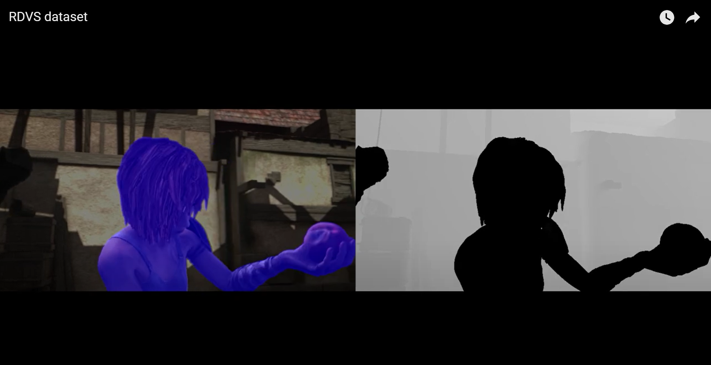
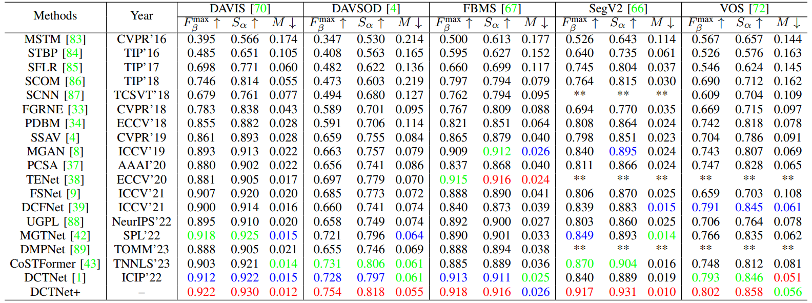
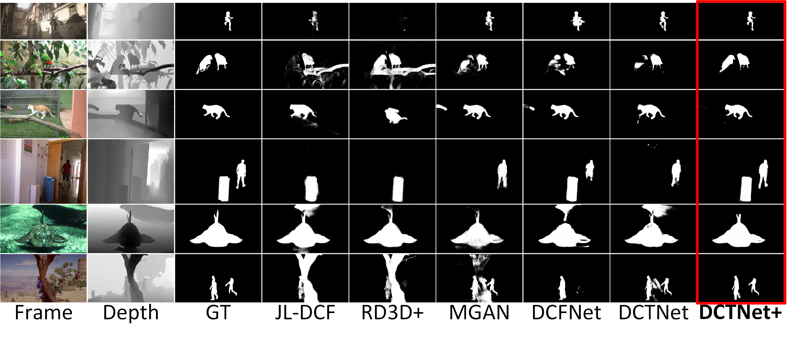
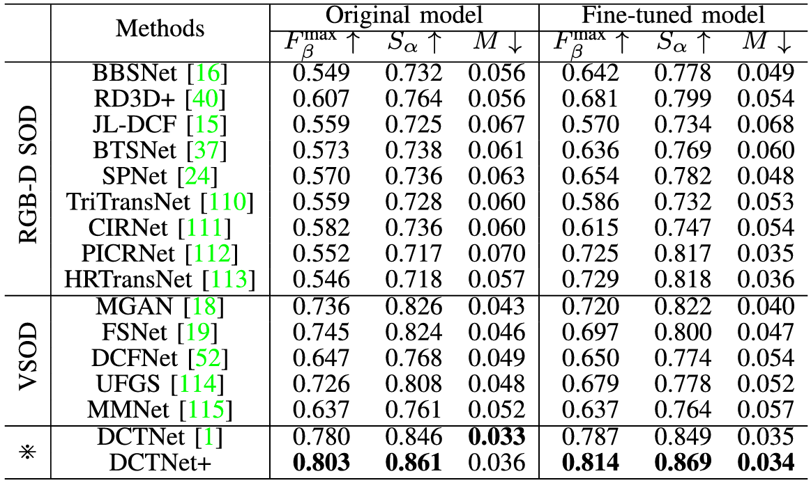
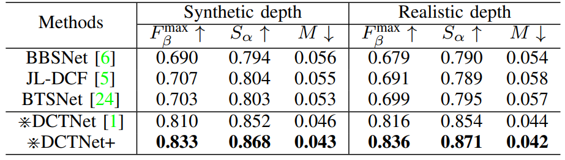
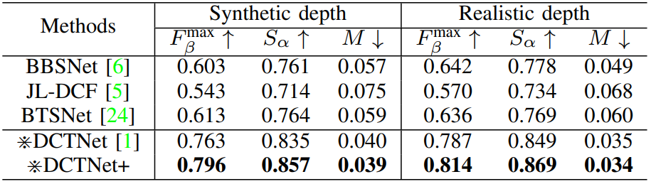

# Salient Object Detection in RGB-D Videos (RDVS dataset and DCTNet+ model)

## This site is still under construction.... 

Code for paper, [**Salient Object Detection in RGB-D Videos**](https://arxiv.org/abs/2310.15482) 

## Table of Contents

- [RDVS dataset and DCTNet+ model <a name="headin"></a>](#Salient-Object-Detection-in-RGB-D-Videos-RDVS-dataset-and-DCTNet-model)
  - [1. Task Relationship](#1-Task-Relationship)
  - [**2. Proposed Dataset: RDVS**](#2-Proposed-Dataset-RDVS)
  - [3. Proposed Model: DCTNet+](#3-Proposed-Model-DCTNet)
    - [3.1 Overview](#31-Overview)
    - [3.2 Usage](#32-Usage)
  - [4. Downloads](#4-Downloads)
    - [4.1 RDVS dataset](#41-RDVS-dataset)
    - [4.2 DCTNet+ model](#42-DCTNet-model)
    - [4.3 Training set and test set](#43-Training-set-and-test-set)
    - [4.4 Saliency Maps on RDVS dataset](#44-Saliency-Maps-on-RDVS-dataset)
    - [4.5 Saliency Maps on five benchmark datasets (pseudo RGB-D video datasets)](#45-Saliency-Maps-on-five-benchmark-datasets-pseudo-RGB-D-video-datasets)
  - [5. Results](#5-Results)
    - [5.1 Quantitative comparison on 5 benchmark datasets](#51-Quantitative-comparison-on-5-benchmark-datasets)
    - [5.2 Qualitative comparison](#52-Qualitative-comparison)
    - [5.3 Straightforward evaluation on the full RDVS dataset](#53-Straightforward-evaluation-on-the-full-RDVS-dataset)
    - [5.4 Evaluation on RDVS test set after fine-tuning](#54-Evaluation-on-RDVS-test-set-after-fine-tuning)
    - [5.5 Synthetic depth v.s. realistic depth](#55-Synthetic-depth-vs-realistic-depth)
  - [6. Citation](#6-Citation)

## 1 Task Relationship
<p align="center">
     <br />
    <em> 
    Figure 1: Due to the limitation of using a single RGB/color modality (image) for SOD (termed RGB SOD), researchers have integrated scene depth information into the SOD task, often referred to as RGB-D SOD. Meanwhile, extending still images to the temporal case yields the video SOD (VSOD) task. We target at the RGB-D VSOD task, which can be deemed as extension from the prevalent RGB-D SOD and VSOD tasks.
    </em>
</p>

> To delve into such a potential task, and as one of the earliest works towards RGB-D VSOD, we contributes on two distinct aspects: 1) the dataset, and 2) the model.

## 2 Proposed Dataset: RDVS

> We propose a new RGB-D Video Salient Object Dataset incorporating realistic depth information, and the dataset is named RDVS for short. RDVS contains 57 sequences, totaling 4,087 frames, and its annotation process is guided rigorously by gaze data captured from a professional eye-tracker. The collected video clips encompass various challenging scenarios, e.g., complex backgrounds, low contrast, occlusion, and heterogeneous objects. We also provide training and testing splits. **Download the RDVS from ["RDVS Dataset"](#41-RDVS-dataset).**

<p align="center">
     <br />
    <em> 
    Figure 2 shows Statistics of the proposed RDVS dataset. (a) Attribute-based analyses of RDVS with comparison to DAVIS. (b) The pairwise dependencies across different attributes. (c) Scene/object categories of RDVS. (d) Center bias of RDVS and existing VSOD datasets.  <br />
    </em>
</p>
&nbsp;
  
<p align="center">
     <br />
    <em> 
    Figure 3: Illustrative frames (with depth in the bottom-right) from RDVS with fixations (red dots, the top row) and the corresponding continuous saliency maps (overlaying on the RGB frames, the bottom row).
    </em>
</p>
&nbsp;
  

[](https://youtu.be/wJpgyDf9594)

<p align="center">
		<em>
		Click the above figure to watch saliency shift of all sequences in RDVS dataset (YouTube Link)
		</em>
</p>

## 3 Proposed Model: DCTNet+
### 3.1 Overview
<p align="center">
     <br />
    <em> 
    Figure 4. Overview of DCTNet+. (a) shows the big picture. (b) and (c) show the details of MAM and RFM, respectively. In the attention operations on the right-hand side in (c), since the coordinate attention and spatial attention processes are similar, the operations of spatial attention are represented in parentheses and are not repeated.
    </em>
</p>

### 3.2 Usage
1. Requirements
   - Python 3.9
   - PyTorch 1.12.1
   - Torchvision 0.13.1
   - Cuda 11.6

2. Training
   - Download the pretrained ResNet34 backbone: [Baidu Pan](https://pan.baidu.com/s/11-u_voUDqbHZKO9rdZcjpg?pwd=wm08) | [Google Drive](https://drive.google.com/file/d/1rhuK4dq7ku2ynnFLspHJC-Zp0vXIbuLi/view?usp=share_link) to './model/resnet/pre_train/'.
   - Download the train dataset (containing DAVIS16, DAVSOD, FBMS and DUTS-TR) from [**"Training set and test set"**](#43-Training-set-and-test-set) and save it at './dataset/train/*'.
   - Download the pretrained RGB, depth and flow stream models from [Baidu Pan](https://pan.baidu.com/s/1yaKnOoqMLwKI99qyoFVaCA?pwd=wm08) | [Google Drive](https://drive.google.com/drive/folders/1DAekgSdIrZH_1a72u-Ikv-LvY5y7Ths5?usp=share_link) to './checkpoints/'
     - Noting: the pre_trained RGB should be saved at './checkpoints/spatial', pre_trained depth shoule be saved at './checkpoints/depth' and flow is same. 
   - The training of entire DCTNet+ utilized one NVIDIA RTX 3090 GPU to accelerate.
     - run  `python train.py` in terminal
3. Testing
   - Download the test data (containing DAVIS16, DAVSOD, FBMS, SegTrack-V2, VOS) from [**"Training set and test set"**](#43-Training-set-and-test-set) and save it at './dataset/test/*'
   - Download the trained model from [**"DCTNet+ model"**](#42-DCTNet-model)(original model ckpt) and modify the  `model_path` to its saving path in the `test.py`.
   - Run `python test.py` in the terminal.


## 4 Downloads
### 4.1 RDVS dataset
- Full dataset with **realistic depth** (4.84G, 57 sequences): [Baidu Pan](https://pan.baidu.com/s/19urVlOpI6u9aoYYAGt4XaA?pwd=wm08) | [Google Drive](https://drive.google.com/file/d/1qTlyTZH4txUF5BGClBj29VFVxjAuSFCj/view?usp=share_link) (**Update link:2023-10-23**)
- Full dataset with synthetic depth (4.76G, 57 sequences): [Baidu Pan](https://pan.baidu.com/s/1pacr_DsFtGI5MRwfx3p2Lw?pwd=wm08) (**Update link:2023-10-23**)
- Training Set containing realistic and synthetic depth (2.56G, 32 sequences): [Baidu Pan](https://pan.baidu.com/s/1benryV0Gzdh0iv3-x3P3JA?pwd=wm08) | [Google Drive](https://drive.google.com/file/d/1CUXZmsVo3K5KGbiqFc8GmgPAJYqWREPx/view?usp=share_link) (**Update link:2023-10-23**)
- Test Set containing realistic and synthetic depth (2.30G, 25 sequences): [Baidu Pan](https://pan.baidu.com/s/1Oa6P2HwZ9kFlyZ6pTRj-7g?pwd=wm08) | [Google Drive](https://drive.google.com/file/d/1wZtCm12IkQ_9md1Nl2S-upuNOF3mb2HU/view?usp=share_link) (**Update link:2023-10-23**)
- **Noting: realistic depth is in "/Depth" and synthetic depth is in "/SyntheticDepth"**
  

### 4.2 DCTNet+ model
- Original model ckpt: [Baidu Pan](https://pan.baidu.com/s/1T_f_IPM9cJt4pzWbFTSgQQ?pwd=wm08) | [Google Drive](https://drive.google.com/file/d/1S8fu419aiXQt-a09SyGD1dXr6V--BjUU/view?usp=share_link) (**Update link:2023-10-23**)
- Finetune on the test set of RDVS with **realistic depth**: [Baidu Pan](https://pan.baidu.com/s/1zSD_0ZyeSCedcyJcLX0G-w?pwd=wm08) | [Google Drive](https://drive.google.com/file/d/1BUQswgT-5B3zDd8zP9waf2cnfuRmj3t4/view?usp=share_link) (**Update link:2023-10-23**)
- Finetune on the test set of RDVS with **synthetic depth**: [Baidu Pan](https://pan.baidu.com/s/1TpKoZULR-yuAeCvrNVoalg?pwd=wm08) | [Google Drive](https://drive.google.com/file/d/1u18exkO4U-e8g0Xv8c-VfW2SDOlWPkpD/view?usp=share_link) (**Update link:2023-10-23**)


### 4.3 Training set and test set
- Noting: The pseudo RGB-D video datasets used for our model training and testing.
- Training set: [Baidu Pan](https://pan.baidu.com/s/19Rqfims6hGc8MjPkoKCrJg?pwd=wm08) (**Update link:2023-10-23**)
- Test set: [Baidu Pan](https://pan.baidu.com/s/1_oNo4X7kSuxNumbTGqeZEg?pwd=wm08) (**Update link:2023-10-23**)

### 4.4 Saliency Maps on RDVS dataset
- Noting: including RGB-D models, VSOD models, DCTNet and our **DCTNet+(last line)**. (**Update link:2023-10-23**)

  |**Year**|**Publisher**|**Paper**|**Model**|**DownloadLink1**|**DownloadLink2**|
  | :-: | :-: | :-: | :-: | :-: | :-: |
  **RGB-D SOD Models**
  |2020 | ECCV | [**BBSNet**](https://arxiv.org/pdf/2007.02713.pdf)|[Code](https://github.com/DengPingFan/BBS-Net)|[Baidu ](https://pan.baidu.com/s/1eyMummax1HQpeI2CBrWZmA?pwd=obe0)| [Google](https://drive.google.com/file/d/11jY81SsF5sefp_6YqfWhzOgtRL2S_rpS/view?usp=sharing)|
  |2020 | CVPR | [**JLDCF**](https://openaccess.thecvf.com/content_CVPR_2020/papers/Fu_JL-DCF_Joint_Learning_and_Densely-Cooperative_Fusion_Framework_for_RGB-D_Salient_CVPR_2020_paper.pdf)|[Code](https://github.com/kerenfu/JLDCF)|[Baidu](https://pan.baidu.com/s/1kDOohakpxGwVRAv9qtDf5w?pwd=4bgi)| [Google](https://drive.google.com/file/d/1F8bui2_PkbK4tpINLU7iShCyLJUcnUNA/view?usp=sharing)|
  |2020 | CVPR | [**S2MA**](https://openaccess.thecvf.com/content_CVPR_2020/papers/Liu_Learning_Selective_Self-Mutual_Attention_for_RGB-D_Saliency_Detection_CVPR_2020_paper.pdf)|[Code](https://github.com/nnizhang/S2MAhttps://github.com/nnizhang/S2MA)|[Baidu](https://pan.baidu.com/s/1PxVWLhXL5VQjgQK-1toZtA?pwd=c3tf)| [Google](https://drive.google.com/file/d/1rvmtWkaiHWZ334H4GvmoXG3CTnIZxW0l/view?usp=sharing)|
  |2020 | ECCV | [**HDFNet**](https://arxiv.org/pdf/2007.06227.pdf)|[Code](https://github.com/lartpang/HDFNet)|[Baidu ](https://pan.baidu.com/s/1XlVARG4jUlbwW411IHq3ng?pwd=dgfi)| [Google](https://drive.google.com/file/d/167Imr4qRFHlKIWE8qc0ngK0yjYQLyXHr/view?usp=sharing)|
  |2020 | TIP | [**DPANet**](https://ieeexplore.ieee.org/document/9247470)|[Code](https://github.com/JosephChenHub/DPANet)|[Baidu](https://pan.baidu.com/s/156frOJuJHqbkZVuYg0aybQ?pwd=ulh6)| [Google](https://drive.google.com/file/d/1zbYRwdrE_WxffiHXh1GLn79oV5LPJytL/view?usp=sharing)|
  |2021 | ICCV | [**SPNet**](https://openaccess.thecvf.com/content/ICCV2021/supplemental/Zhou_Specificity-Preserving_RGB-D_Saliency_ICCV_2021_supplemental.pdf)|[Code](https://github.com/taozh2017/SPNet)|[Baidu](https://pan.baidu.com/s/1RVdliC67daR_JJ44_-oYSQ?pwd=5rur)| [Google](https://drive.google.com/file/d/1dhmugEo8aKEk-C6C1o7ya2FF8LI6VVa4/view?usp=sharing)|
  |2021 | TIP | [**CDNet**](https://ieeexplore.ieee.org/document/9366409)|[Code](https://github.com/blanclist/CDNet)|[Baidu ](https://pan.baidu.com/s/1a-Eqeyf8Qvam81EZLw3Mtw?pwd=fvf1)| [Google](https://drive.google.com/file/d/1W7pRQy9KfEXmnVsK_IaPZSesHEzeemF1/view?usp=sharing)|
  |2021 | CVPR | [**DCF**](https://openaccess.thecvf.com/content/CVPR2021/papers/Ji_Calibrated_RGB-D_Salient_Object_Detection_CVPR_2021_paper.pdf)|[Code](https://github.com/jiwei0921/DCF)|[Baidu ](https://pan.baidu.com/s/1O7heB5mgbgbMHz0pTOOFOA?pwd=aguk)| [Google](https://drive.google.com/file/d/1j0iG2DPtv6iI4I3J6IN_N7_yZx6xawfW/view?usp=sharing)|
  |2021 | ACMMM | [**TriTransNet**](https://arxiv.org/pdf/2108.03990.pdf)|[Code](https://github.com/liuzywen/TriTransNet)|[Baidu](https://pan.baidu.com/s/1AL1E8clMzPNek6kScyKzEw?pwd=svra)| [Google](https://drive.google.com/file/d/1QZIAO_QzSbIKmDFJPlsgXK2krL1kMQPJ/view?usp=sharing)|
  |2021 | ICME | [**BTSNet**](https://arxiv.org/pdf/2104.01784.pdf)|[Code](https://github.com/zwbx/BTS-Net)|[Baidu](https://pan.baidu.com/s/1RgsWbFM2hutchErblTXJHQ?pwd=hi7x)| [Google](https://drive.google.com/file/d/1BfQ1pkgUSh4tbiG1Fp3bDzYfp6XcvzIE/view?usp=sharing)|
  |2022 | TNNLS | [**RD3D**](https://ieeexplore.ieee.org/document/9889257)|[Code](https://github.com/PolynomialQian/RD3D)|[Baidu](https://pan.baidu.com/s/1oLSu4jxZFaRDYeitAKJTYA?pwd=vwwf)| [Google](https://drive.google.com/file/d/121KkhNQoHHsjvfiuUbsIeIU6t6w3DvXH/view?usp=sharing)|
  |2022 | TIP | [**CIRNet**](https://arxiv.org/abs/2210.02843)|[Code](https://github.com/rmcong/CIRNet_TIP2022)|[Baidu](https://pan.baidu.com/s/1ZvcpKxbRbhPsDT2C8rJmtA?pwd=wm08)|[Google](https://drive.google.com/file/d/1ilnq7pcj7_PDVZ6f0Is5x3toyAL3xcSM/view?usp=share_link)|
  |2023 | ACMMM | [**PICRNet**](https://arxiv.org/pdf/2308.08930.pdf)|[Code](https://github.com/rmcong/PICR-Net_ACMMM23)|[Baidu](https://pan.baidu.com/s/1m2PgKeacrRjtPBVDpthv1w?pwd=wm08)|[Google](https://drive.google.com/file/d/1D7gtpgActmZczykD1j858xKEVN1dGEWF/view?usp=share_link)|
  |2023 | TCSVT | [**HRTransNet**](https://arxiv.org/pdf/2301.03036.pdf)|[Code](https://github.com/liuzywen/HRTransNet)|[Baidu](https://pan.baidu.com/s/1-zFEEPELXb2h380I_H5I0Q?pwd=wm08)|[Google](https://drive.google.com/file/d/1yTYvz8eIhIdMZZPu_YK1ab5rcQ2fr4Nz/view?usp=share_link)|
  **VSOD Models**
  |2018 | ECCV |[**PDB**](https://openaccess.thecvf.com/content_ECCV_2018/papers/Hongmei_Song_Pseudo_Pyramid_Deeper_ECCV_2018_paper.pdf)|[Code](https://github.com/shenjianbing/PDB-ConvLSTM)|[Baidu ](https://pan.baidu.com/s/1J7gUaAQhXxpF3Rd0jdrtQg?pwd=ef57)| [Google](https://drive.google.com/file/d/13nyOcHhoYHn9_H3bAsw4JpslskQz43Re/view?usp=sharing)|
  |2019 | ICCV | [**MGAN**](https://openaccess.thecvf.com/content_ICCV_2019/papers/Li_Motion_Guided_Attention_for_Video_Salient_Object_Detection_ICCV_2019_paper.pdf)|[Code](https://github.com/lhaof/Motion-Guided-Attention)|[Baidu ](https://pan.baidu.com/s/1qp6_wrPowCea-pNedtbNkg?pwd=rufu)|[Google](https://drive.google.com/file/d/1_GP2dNE8ySdYACBNgB4rRwYQJjghiPhC/view?usp=sharing)|
  |2019 | CVPR | [**SSAV**](https://openaccess.thecvf.com/content_CVPR_2019/papers/Fan_Shifting_More_Attention_to_Video_Salient_Object_Detection_CVPR_2019_paper.pdf)|[Code](https://github.com/DengPingFan/DAVSOD)|[Baidu](https://pan.baidu.com/s/1Rhjh0vvHqfqHpgC83-60XA?pwd=iq5g)| [Google](https://drive.google.com/file/d/1yf8Kr-B2HijYH5VloztAYcKwnRVGM0cH/view?usp=sharing)|
  |2020 | AAAI | [**PCSA**](https://aaai.org/papers/10869-pyramid-constrained-self-attention-network-for-fast-video-salient-object-detection/)|[Code](https://github.com/guyuchao/PyramidCSA)|[Baidu ](https://pan.baidu.com/s/1GbalsdHdQ75cfKSdSao5qA?pwd=rd09)| [Google](https://drive.google.com/file/d/1jwjJ5do_s9Hc906PtoCdBN8LjiAyCp0N/view?usp=sharing)|
  |2021 | ICCV | [**FSNet**](https://openaccess.thecvf.com/content/ICCV2021/papers/Ji_Full-Duplex_Strategy_for_Video_Object_Segmentation_ICCV_2021_paper.pdf)|[Code](https://github.com/GewelsJI/FSNet)|[Baidu ](https://pan.baidu.com/s/1fYTZ6awbJNy-XHh_IWDk6g?pwd=9hie)| [Google](https://drive.google.com/file/d/1sy4f2vylcQAGk1hS9RNeWygOXvJyBdkA/view?usp=sharing)|
  |2021 | ICCV | [**DCFNet**](https://openaccess.thecvf.com/content/ICCV2021/papers/Zhang_Dynamic_Context-Sensitive_Filtering_Network_for_Video_Salient_Object_Detection_ICCV_2021_paper.pdf)|[Code](https://github.com/Roudgers/DCFNet)|[Baidu](https://pan.baidu.com/s/1zabfNUWB35z9FbpEjELYJA?pwd=hubj)| [Google](https://drive.google.com/file/d/1Yg57Lyx5eGiK8K0yI0tZoJK_cZQDRyDc/view?usp=sharing)|
  **RGB-D VSOD Models**
  |2022 | ICIP | [**DCTNet**](https://arxiv.org/pdf/2202.06060.pdf)|[Code](https://github.com/luyukang/DCTNet)|[Baidu](https://pan.baidu.com/s/1VB0sJSUYxoUl__fQx8A-pA?pwd=yzd8)| [Google](https://drive.google.com/file/d/1PwIuErcxUhyWoBejPXbRJ3qXvg5zlezx/view?usp=sharing)|
  |--|--|**DCTNet+**|--|[Baidu](https://pan.baidu.com/s/1B6Uj4V--rkOoAhbjpct75g?pwd=wm08)|[Google](https://drive.google.com/file/d/1PAdQjicRPCsP5cRS9H-AslCMGTprrWxh/view?usp=share_link)|


### 4.5 Saliency Maps on five benchmark datasets (pseudo RGB-D video datasets)
- Noting: including DAVIS, DAVSOD-easy, FBMS, SegTrack-V2 and VOS. (**Update link:2023-10-23**) Other results before 2019 can be redirected to [DAVSOD](https://github.com/DengPingFan/DAVSOD/tree/master). 

  |**Year**|**Publisher**|**Paper**|**Model**|**DownloadLink1**|**DownloadLink2**|
  | :-: | :-: | :-: | :-: | :-: | :-: |
  **RGB-D SOD Models**
  |2019 | ICCV | [**MGAN**](https://openaccess.thecvf.com/content_ICCV_2019/papers/Li_Motion_Guided_Attention_for_Video_Salient_Object_Detection_ICCV_2019_paper.pdf)|[Code](https://github.com/lhaof/Motion-Guided-Attention)|[Baidu](https://pan.baidu.com/s/1Gk840mOhwD_ZzM-ThfAgeQ?pwd=wm08)|[Google](https://drive.google.com/file/d/1WeomnFiNrL7PsxitmddeI4z4iMGOx_Nm/view?usp=share_link)|
  |2020 | AAAI | [**PCSA**](https://aaai.org/papers/10869-pyramid-constrained-self-attention-network-for-fast-video-salient-object-detection/)|[Code](https://github.com/guyuchao/PyramidCSA)|[Baidu](https://pan.baidu.com/s/16zchG7z5q-wujUGm3aBQwg?pwd=wm08)|[Google](https://drive.google.com/file/d/1JYBUoSc8_FD4iUgTV_omOM3G6dAbL9FU/view?usp=share_link)|
  |2020 | ECCV | [**TENet**](https://www.ecva.net/papers/eccv_2020/papers_ECCV/papers/123500205.pdf)|[Code](https://github.com/OliverRensu/TENet-Triple-Excitation-Network-for-Video-Salient-Object-Detection)|[Baidu](https://pan.baidu.com/s/1ms-sUPX3BN8g8ioRFi22Ig?pwd=wm08)|[Google](https://drive.google.com/file/d/1HITpyfXwMV9VJjFEdiF8ct2QM4yE119Z/view?usp=share_link)|
  |2021 | ICCV | [**FSNet**](https://openaccess.thecvf.com/content/ICCV2021/papers/Ji_Full-Duplex_Strategy_for_Video_Object_Segmentation_ICCV_2021_paper.pdf)|[Code](https://github.com/GewelsJI/FSNet)|[Baidu](https://pan.baidu.com/s/1Oht9__gDlaq1PbxMf4SS7A?pwd=wm08)|[Google](https://drive.google.com/file/d/13VuysU4j9h3FYslXsezWFjPV43SCkti8/view?usp=share_link)|
  |2021 | ICCV | [**DCFNet**](https://openaccess.thecvf.com/content/ICCV2021/papers/Zhang_Dynamic_Context-Sensitive_Filtering_Network_for_Video_Salient_Object_Detection_ICCV_2021_paper.pdf)|[Code](https://github.com/Roudgers/DCFNet)|[Baidu](https://pan.baidu.com/s/1zFOzWcyPj5AJMUw9fgSthQ?pwd=wm08)|[Google](https://drive.google.com/file/d/1uVof1nrPN2Kr4fzeAekfJsDrW_dYg83H/view?usp=share_link)|
  |2022 | NIPS | [**UGPL**](https://openreview.net/pdf?id=BOQr80FBX_)|[Code](https://github.com/Lanezzz/UGPL)|[Baidu](https://pan.baidu.com/s/1o17YC9UtA1YEDqnKho9dKQ?pwd=wm08)|[Google](https://drive.google.com/file/d/1RSeNSa_ORC-WwUSPEdQ5dW0GO6Zr8SER/view?usp=share_link)|
  |2022 | SPL | [**MGTNet**](https://ieeexplore.ieee.org/abstract/document/9834060)|[Code](https://github.com/mindingyao/MGT-Net)|[Baidu](https://pan.baidu.com/s/12WTOzx51OItJP3VgPP0TVQ?pwd=wm08)|[Google](https://drive.google.com/file/d/1PMMhJ5q6KsFoKTY4NVs3TzrTraW7-LhO/view?usp=share_link)|
  |2023 | TNNLS | [**CoSTFormer**](https://ieeexplore.ieee.org/abstract/document/10045751)| -- |[Baidu](https://pan.baidu.com/s/1dp0yLMyaBxCOh2WHSwG_9A?pwd=wm08)|[Google](https://drive.google.com/file/d/1Nf7DfsGg1ezjOrLbPuMTDmGiUuLUZll4/view?usp=share_link)|
  **RGB-D VSOD Models**
  |2022 | ICIP | [**DCTNet**](https://arxiv.org/pdf/2202.06060.pdf)|[Code](https://github.com/luyukang/DCTNet)|[Baidu](https://pan.baidu.com/s/174-tF-2ae-UJLMIb-010yg?pwd=wm08)|[Google](https://drive.google.com/file/d/1-r6aOgt8jrWT9apIPiFV8RWPVXC1kNPw/view?usp=share_link)|
  | -- | -- | **DCTNet+** | -- |[Baidu](https://pan.baidu.com/s/1h4nbs_WVneMRLPcGPHFezQ?pwd=wm08)|[Google](https://drive.google.com/file/d/1jjJU1ReGun5UI5jXulcEwbV5BEQPnXYZ/view?usp=share_link)|
  
  
## 5 Results
### 5.1 Quantitative comparison on 5 benchmark datasets
<em>
Table 1. Quantitative comparison with state-of-the-art VSOD methods on 5 benchmark datasets. The top three results are represented in red, green, and blue from top to bottom, respectively. ↑/↓ denotes that the larger/smaller value is better. Symbol `**' means that results are not available.
</em>
<p align="center">
     <br />
</p>

### 5.2 Qualitative comparison
<p align="center">
     <br />
    <em> 
    Figure 5. Qualitative comparison of our DCTNet+ model and SOTA methods on conventional VSOD benchmarks.
    </em>
</p>

### 5.3 Straightforward evaluation on the full RDVS dataset
<em> 
    Table 2. Results of SOTA methods in different fields and the proposed method on RDVS dataset, where the suffix "⋇" indicates RGB-D VSOD techniques, ↑/↓ denotes that the larger/smaller value is better. The best are stressed in BOLD. 
</em>
<p align="center">
     <br />    
</p>
&nbsp;
  
<p align="center">
     <br />
    <em> 
    Figure 6. Qualitative comparison on the proposed RDVS dataset.
    </em>
</p>

### 5.4 Evaluation on RDVS test set after fine-tuning
<em> 
    Table 3. Results of SOTA methods in different fields as well as the proposed method on RDVS testing set. The left half are the results of the original model applied directly on the RDVS testing set, and the right half are the results obtained by re-training the models consistently on the RDVS training set and then evaluating them on the RDVS testing set. The best are stressed in BOLD.
</em>
<p align="center">
     <br />
</p>

### 5.5 Synthetic depth v.s. realistic depth
 <em> 
    Table 4. Experimental results of comparing synthetic depth maps and realistic depth maps by applying the original models to the full RDVS dataset. The best are stressed in BOLD.
</em>
<p align="center">
     <br />
</p>
&nbsp;

<em> 
    Table 5. Experimental results of comparing synthetic depth maps and realistic depth maps by fine-tuning the models on the RDVS training set. The best are stressed in BOLD.
</em>
<p align="center">
     <br /> 
</p>

## 6 Citation
Please cite our paper if you find the work useful:

```
@inproceedings{lu2022depth,
  title={Depth-cooperated trimodal network for video salient object detection},
  author={Lu, Yukang and Min, Dingyao and Fu, Keren and Zhao, Qijun},
  booktitle={2022 IEEE International Conference on Image Processing (ICIP)},
  pages={116--120},
  year={2022},
  organization={IEEE}
}

@misc{mou2023RDVS,
      title={Salient Object Detection in RGB-D Videos}, 
      author={Ao Mou and Yukang Lu and Jiahao He and Dingyao Min and Keren Fu and Qijun Zhao},
      year={2023},
      eprint={2310.15482},
      archivePrefix={arXiv},
      primaryClass={cs.CV}
}
```


[⬆ back to top](#headin)


